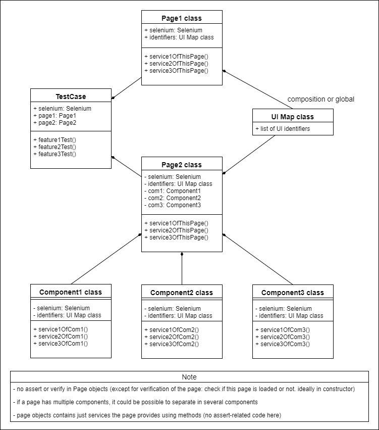

# Page Object Design Pattern and UI Map Class

Unit testing and integration testing are essential components when building stable project; however, fanctional testing is the final step to make sure that a certain functionality works properly. In some case of fanctional testing, front-end programming is involved in the test. Browser testing is the solution to deal with such cases.

Browser testing tools such as Selenium and Dusk in Laravel are useful. However, It is also important to think about how to organize browswer testing classes in order to make your code maintainable and avoid any duplicated code. Page object design pattern and UI Map class allow you to accommodate such a request.

Here is my diagram how Page Object pattern and UI Map class works:

